# Web使用

### 仪表盘
&emsp;&emsp;首页仪表盘统计了最近24小时的socket连接情况，详细如图所示
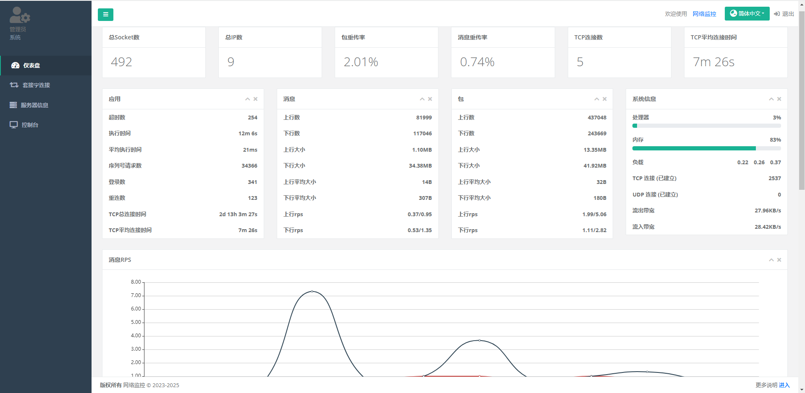
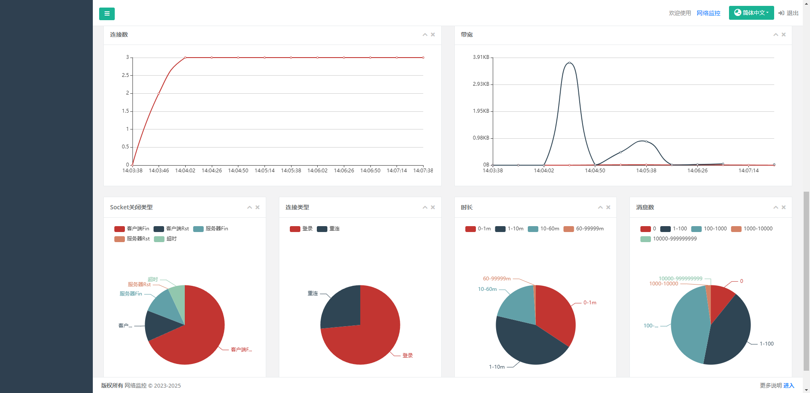

### 套接字
&emsp;&emsp;套接字展示最近30天所有socket创建列表。可通过玩家Id和客户端Ip进行模糊查询，创建时间和结束时间进行排序。
每个socket连接断开时会进行预警检测，发送到sentry中，具体逻辑如下：
1. 失败数>10&&失败率>0.1 ==> 网络监控：玩家%v ip=[] 消息=[%v=%v] 请求=%v次 失败=%v次 失败率=%v
2. 请求数>10&&平均延迟>200 ==> 网络监控：玩家%v ip=[%v] 消息=[%v=%v] 请求=%v次 平均延迟=%vms 最大延迟=%vms
3. 请求数>100&&（重复请求>10||重复返回>10) ==> 网络监控：玩家%v ip=[%v] 消息=[%v=%v] 请求=%v次 重复请求=%v 重复返回=%vms

&emsp;&emsp;点击`详细`按钮可查看每个socket的详细消息请求，可进行线上玩家Bug排查辅助，判断服务器有没有给客户端反消息或消息是否正确。  
&emsp;&emsp;点击`统计`按钮可查看每个socket的消息统计：延迟、数量、重复请求、字节大小、rps......
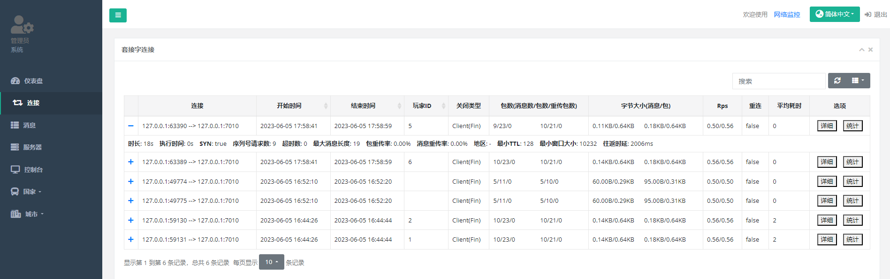
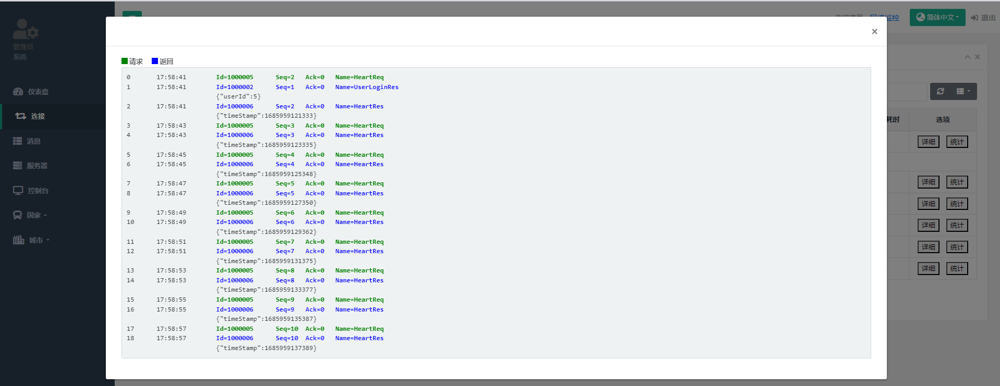
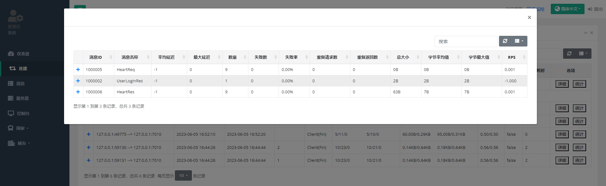

### 消息
&emsp;&emsp;展示`net-service`启动到现在所监控网关所有收发消息的统计，包括延迟、数量、重复请求、字节大小、rps等。
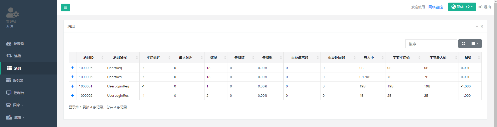

### 服务器
&emsp;&emsp;可查看服务器启动到现在或最近24小时的负载、CPU百分比、内存、连接数、带宽。
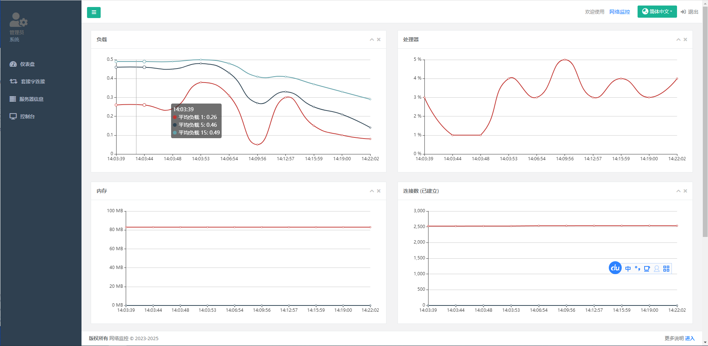

### 控制台
&emsp;&emsp;控制台可事实查看网关消息，可选择`Socket关闭或打开``基础日志``详细日志`三种模式，可过滤ip和玩家Id
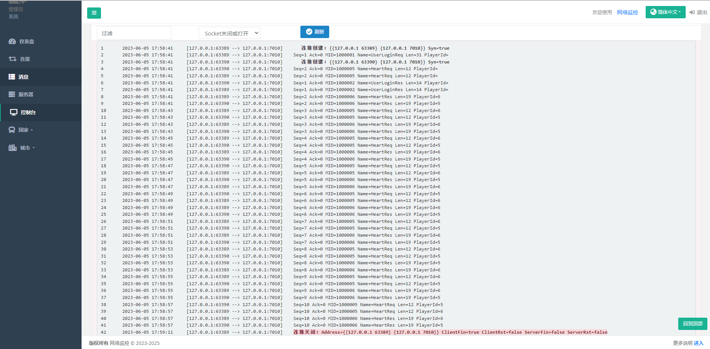

### 国家&城市
&emsp;&emsp;国家和城市分别根据范围大小进行统计分析，最近24小时的数据。

* **列表**  
  展示国家或城市所有的详细统计，可在搜索栏查询国家或城市关键字。
  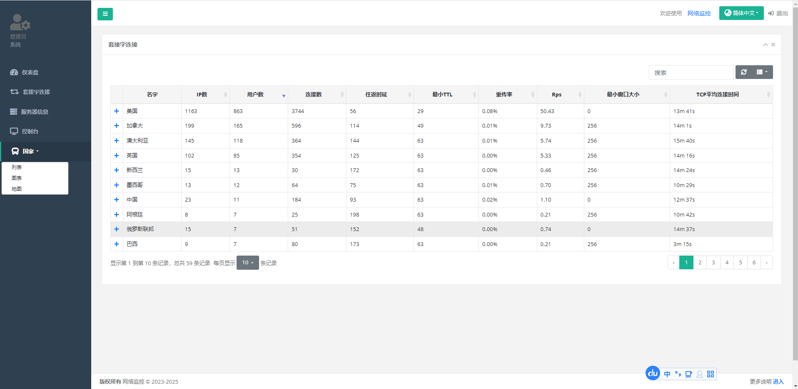
* **图表**  
  国家或城市关键信息柱状图对比线上，只显示用户数最多的前50条数据。
  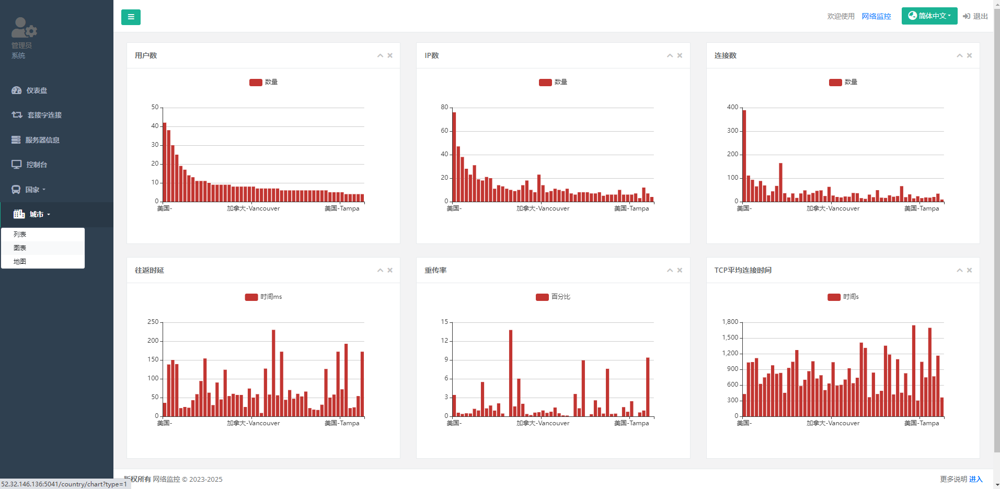
* **地图**  
  国家或城市用户地图分布状况，主要查看玩家所在区域，人数，延迟等。 标记圆圈半径=socket连接数*100m；颜色表示延迟,绿色<100ms,黄色<200ms,红色>200ms
  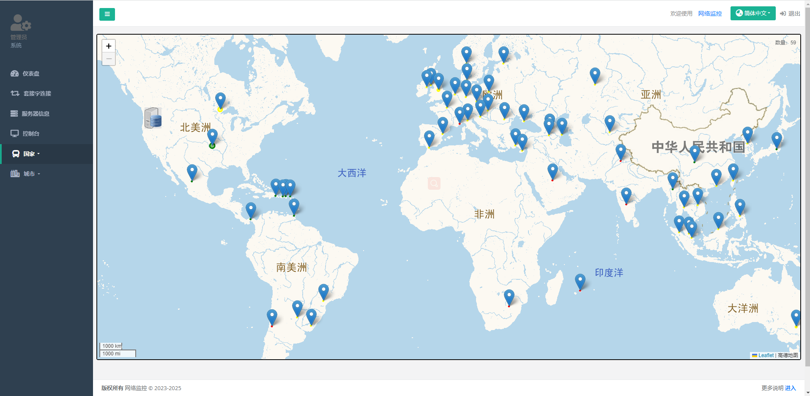
